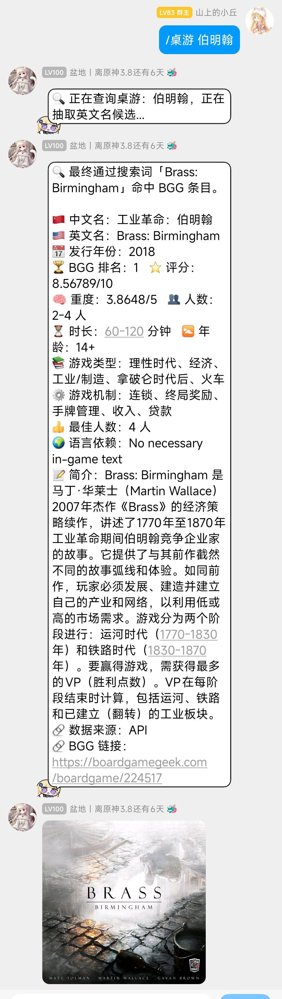
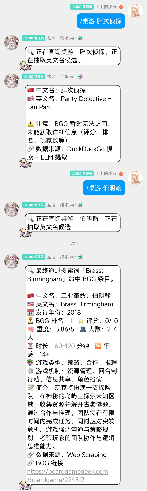
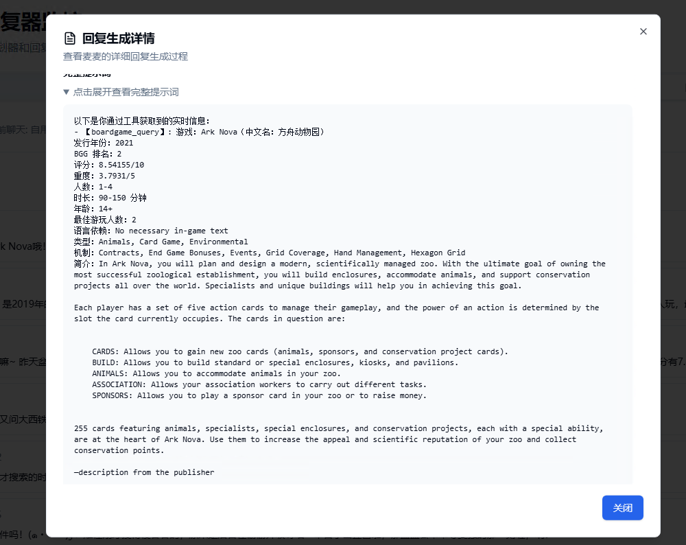

# 桌游搜索插件 (bgg_search_plugin)

一个基于maibot用于查询桌游信息的插件，支持中文/简称/黑话输入，自动通过 DDGS 搜索并由AI抽取英文名，或根据本地字典查询桌游对应的英文名，并从 BGG 网站获取游戏详细信息。包含两个Command组件与一个Tool组件。

## 功能特点

- 智能搜索：支持中文、简称、黑话等多种输入方式
- 自动翻译：通过 DDGS 和 LLM 自动提取桌游英文名、也支持词典录入
- BGG 数据：从 BoardGameGeek 获取完整的游戏信息
- 详细信息：包括中英文名、发行年份、排名、评分、重度、人数、时长、年龄、简介等
- 图片支持：自动获取并显示游戏封面图片
- 备用方案：当 BGG API 不可用时，自动切换到网页搜索方案
- 双方案调用：作为tool注册，可在llm需要是自动调用提供信息。也可采用指令由用户手动触发。
## 使用方法

### 基本命令

/桌游 [游戏名称]

/桌游登记 [游戏名称]/[游戏英文名]

/桌游登记 [游戏名称]/删除

### 示例

/桌游 肥肠面

/桌游 三国杀

/桌游登记 肥肠面/Food Chain Magnate 

/桌游登记 肥肠面/删除 

## 安装说明

### 依赖安装

本插件依赖以下 Python 包：

- `httpx`：HTTP 客户端，用于请求 BGG API 和网页抓取
- `ddgs`：DuckDuckGo 搜索 Python 绑定，用于获取中文名对应的英文名候选
- `beautifulsoup4`：HTML 解析库，用于 BGG 网页回退方案

插件系统会自动检测并提示安装依赖；如遇报错，也可以（在运行环境）手动执行：

`pip install httpx ddgs beautifulsoup4`

### 插件配置

1\. 将插件文件放入插件目录

2\. 重启maibot后生成配置文件，修改配置文件后再次重启maibot即可

3\. 确保网络连接正常（需要访问 BGG 和 DDGS），因此强烈建议使用代理

## 技术特点

\- 异步处理：使用异步 HTTP 客户端提高性能

\- 错误处理：完善的异常处理机制

\- 数据缓存：支持本地黑话字典映射（可使用指令录入）

\- 多源数据：结合 DDGS 搜索和 BGG 官方数据

\- 备用方案：当 API 不可用时自动切换到网页搜索

## 工作原理

在接到用户或 LLM 传入的桌游名称后（不论中英文）：

1. 插件首先会在本地词典内查找对应的英文名（默认词典约等于空）。
2. 如果查不到，会使用 DDGS 搜索“桌游名 桌游的英文是什么？”。
3. 将搜索结果交给 Utils 模型（LLM）提炼总结出英文名。
4. 最后根据该名字从 BGG 获取数据。
5. 如果开启了“AI 翻译”，用户查询的时候还会再过一遍 AI 翻译才给出最终结果。

## 注意事项

- **关于代码**：该插件主要由 GLM-4.7 编写，我本人其实并不会编程，所以有问题请完善的提供日志与报错，我会尽力修，但不保证能修。
- **网络要求**：需要稳定的网络连接访问 BGG 和 DDGS。**因为最终查询质量受 DDGS 的搜索质量直接影响，而 DDGS 需要代理才能提供更好的搜索结果，因此强烈建议使用代理。**
- **LLM 依赖**：需要可用的 LLM 模型进行英文名提取，需要 MaiBot 正确配置 Utils 模型。
- **数据更新**：BGG 数据实时更新，插件会自动获取最新信息。
- **日志配置**：配置中“详细日志”功能**默认关闭**。如遇问题可打开它查看具体的搜索结果与 API 返回；若觉得刷屏太严重，可在配置中关闭。
- **查询准确性**：**最后再次警告，本插件严重依赖 DDGS 搜索 + AI 提炼作为查询所搜索的桌游英文名的关键，因此可能会在使用过程中出现查询错误的情况。**
  - 这种时候一般检查你的代理或直接查询英文名会是一个很好的解决方案。
  - 如果某游戏或该游戏简称真的很常用，可以写入 `data/alias.json` 字典，这样就能跳过整个插件运作逻辑中最不确定的部分。
- **词典录入**：使用指令“/桌游登记 桌游中文名/桌游英文名“录入字典、“/桌游登记 桌游中文名/删除“删除字典对应条目，处于代码简单的考量，不支持覆盖，如果录入已有字典会提示先删除再重新录入。

## 文件结构

- data/terms.json：桌游中英文名字词典
- data/alias.json：常用机制与类型翻译
- utils.py：常量 + 头部构造 + JSON 加载
- ddg_client.py：DuckDuckGo 搜索 + LLM 抽中文名/英文名候选
- bgg_client.py：BGG XMLAPI2/V1 搜索 + 详情 + resolve_boardgame_by_cn_name 聚合
- web_client.py：BGG 网页搜索 + 详情回退
- register.py：桌游中英文名字词典典录入
- plugin.py：Command / Tool / 插件类与注册，导入以上模块

## 开发者信息

\- 作者：山上的小丘

\- GitHub：https://github.com/fsqhn

\- 许可证：GPL-v3.0-or-later

## 更新日志
### **0.0.3**： 
- 完善 BGG 搜索插件日志与数据来源说明
- 增加桌游中英文名字词典录入指令
- 增加 verbose 模式下的 DDG 搜索结果详细日志输出
- 在最终回复中标注数据来源（词典 vs DDG+AI；API vs 网页抓取）
- 优化配置项控制逻辑

---

\*注意：插件会持续更新以支持更多功能和更好的用户体验。\*

